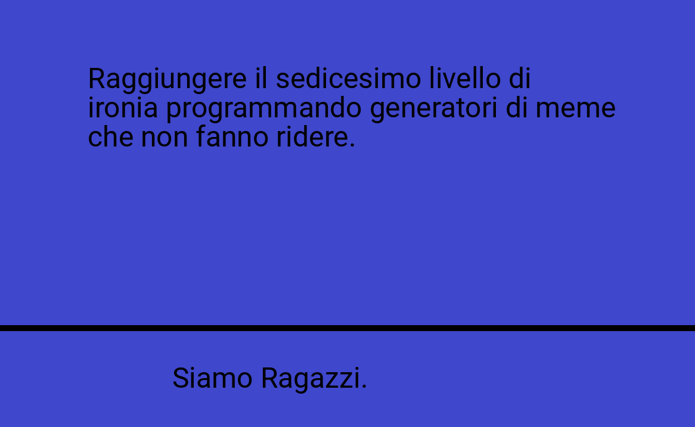
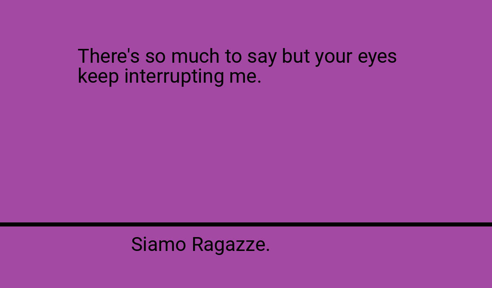
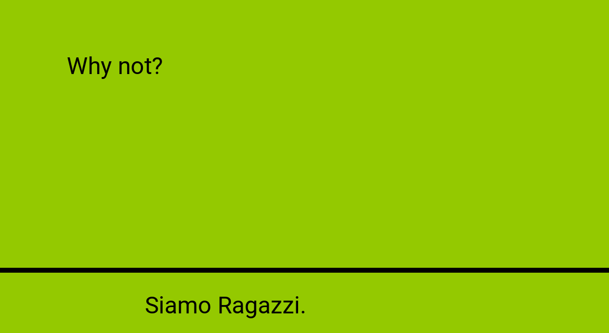
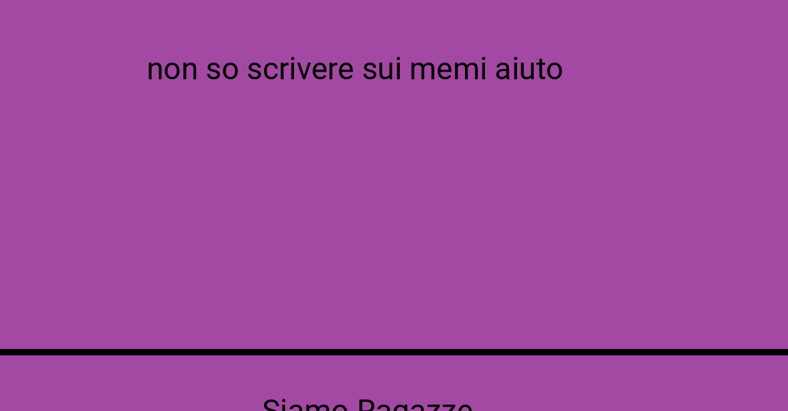

# Siamo ragazzi.

"Siamo ragazzi." cringe meme CLI generator.



I'm ~~not~~ sorry.

## Installation

Install with pipx:

```console
$ pipx install siamo_ragazzi
```

## Usage
 
The generator can be invoked from the command line with the `siamo-ragazzi` executable.

> The above meme was generated with:
> 
> ```console
> $ echo "Raggiungere il sedicesimo livello di ironia programmando generatori di meme che non fanno ridere." | siamo-ragazzi -k "male" -o "media/example.png" -s "deterministico"
> ```

### Customization

The generated meme can be fully customized with command line parameters:

```text
Usage: siamo-ragazzi [OPTIONS]

Options:
  -k, --kind TEXT              The meme variation. If not specified, picks a random variation.
  -t, --top-text FILENAME      Path to the file containing text appearing at the top of the meme. Defaults to stdin.
  -b, --bottom-text TEXT       Overrides the text appearing at the bottom of the meme.
  -c, --background-color TEXT  Overrides the background color of the meme.
  -f, --foreground-color TEXT  Overrides the foreground color of the meme.
  -f, --font FILE              Path to the TrueType font to be used in the meme.
  -s, --seed TEXT              Set the random seed.
  -v, --variation INTEGER      Pixel variation for sizes and positions.
  -o, --output FILENAME        Path to save the png output to. Defaults to stdout.
  --help                       Show this message and exit.
```

### More examples

#### Generate a random quote from `fortune` as a `siamo-ragazzi` meme

```console
$ fortune | siamo-ragazzi -o "media/fortune.png"
```



#### Generate a gender-neutral version of the meme

```
$ echo "Why not?" | siamo-ragazzi --kind "i" --background-color "#94c900" -o "media/neutral.png"
```



#### Increase the positioning variation

```
$ echo "non so scrivere sui memi aiuto" | siamo-ragazzi --variation 120 -o "media/variation.png"
```


